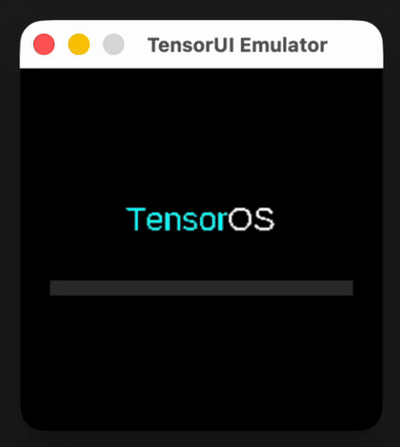

# TensorUI

A lightweight, premium-styled UI framework for embedded systems and cross-platform applications, written in pure C with SDL2.



## 🚀 Overview

TensorUI is designed to provide a modern, responsive, and aesthetically pleasing interface for resource-constrained environments. It features a layout engine similar to modern web frameworks (VStack, HStack), advanced gesture support, and a flexible window management system.

### Features
- **Modern Layouts**: Flex-box inspired `VStack` and `HStack` for easy component positioning.
- **Premium Components**: Includes Buttons, Labels, Sliders, Progress Bars, Toggles, and interactive Canvases.
- **Custom Font Engine**: Fast, specialized font rendering for crisp text.
- **Window Management**: Built-in stack-based window management for complex app navigation.
- **HAL Layer**: Clean Hardware Abstraction Layer for easy transplanting to different displays or input devices.
- **Animated Toast System**: Non-intrusive notification system.

## 📱 Embedded Apps (TensorOS Demo)
The included `TensorOS_Demo` showcases the framework's capabilities:
- **Snake Game**: A classic arcade game utilizing touch/mouse direction control.
- **Calculator**: A fully functional arithmetic calculator.
- **Digital Paint**: An interactive canvas for free-hand drawing.
- **System Settings**: A complex nested interface with toggles and sliders.

## 🛠 Tech Stack
- **Language**: C99
- **Graphics & Input**: SDL2
- **Hardware Abstraction**: Custom HAL for Screen, Input, Time, and Font operations.

## 🏗 Project Structure
- `TensorUI/`: Core framework components (Layouts, UI elements, Window Manager).
- `examples/`: Ready-to-run demonstration applications.
- `hal/`: Hardware Abstraction Layer implementations.
- `fonts/`: Pre-rendered `.bfont` resources.
- `tools/`: Python utilities for generating custom font assets.

## 🚀 Getting Started

### Prerequisites
- GCC or Clang
- SDL2 development libraries (e.g., `brew install sdl2` on macOS)

### Build and Run
```bash
make clean && make run
```

## 📄 License
This project is part of the TensorCraft ecosystem. See individual source files and `fonts/SIL Open Font License.txt` for specific licensing details.
